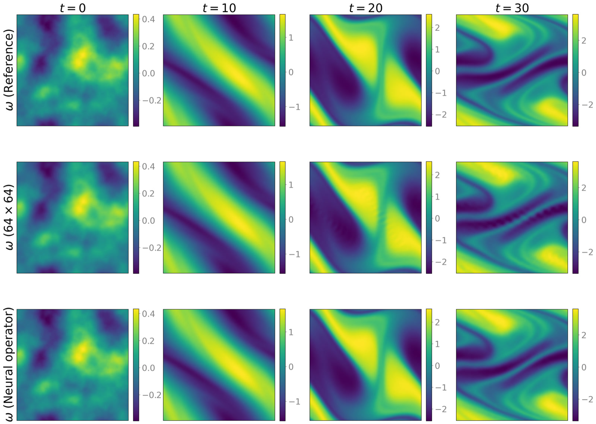

<div align="center">
  <h1>Cost–Accuracy Trade-offs: Neural Operator vs Classical Numerical Solver</h1>
  <p>Research code accompanying the paper by <strong>Daniel Zhengyu Huang</strong> and <strong>Andrew M. Stuart</strong></p>
  <p>
    <a href="#overview">Overview</a> ·
    <a href="#benchmarks">Benchmarks</a> ·
    <a href="#examples-and-results">Examples</a> ·
    <a href="#repository">Repository</a> ·
    <a href="#citation">Citation</a>
  </p>
</div>

## Overview

This repository studies a practical question: **after data generation and training costs have been amortized, when does neural-operator inference offer a better per-query cost–accuracy trade-off than a strong classical numerical solver?** We compare prediction error, floating-point work, and CPU/GPU wall-clock runtime in the post-training, many-query regime.

The experiments lead to three main conclusions:

- The reported measurements indicate that, at low-to-moderate accuracy requirements, the tested neural operators can substantially reduce wall-clock runtime at comparable error levels.
- The source of acceleration is problem-dependent: efficient tensor operations, reduced sequential time stepping, or direct prediction of a lower-dimensional quantity of interest.
- At higher accuracy requirements in all three benchmarks, the tested neural operators do not attain the lower error levels reached by the classical numerical methods.

The experiments also reveal important limitations of neural operators:

- Additional training data or model capacity yields diminishing improvements and may still fail to meet stringent accuracy requirements.
- In time-dependent problems, prediction errors can accumulate rapidly over long horizons.
- Reliability can vary substantially across inputs, raising even greater concerns for out-of-distribution inputs.

## Benchmarks

| Benchmark | Requested output and error | Classical baseline | Neural-operator acceleration mechanism |
|---|---|---|---|
| 2D Darcy flow | Pressure field; relative <em>L</em><sup>2</sup> error | <em>Q</em><sub>1</sub> finite elements with geometric multigrid (Firedrake/PETSc) | Hardware-efficient dense tensor operations |
| 2D incompressible Navier–Stokes flow | Future vorticity field; relative <em>L</em><sup>2</sup> error | Fourier pseudospectral discretization with RK4 time integration (GeophysicalFlows.jl) | Reduced sequential time-stepping depth |
| 3D vehicle aerodynamics | Surface pressure coefficient <em>C</em><sub>p</sub>; discrete pointwise relative <em>L</em><sup>1</sup> error | Finite-volume RANS discretization with SIMPLE iteration (OpenFOAM 12) | Direct surface prediction, avoiding a full volumetric solve and nonlinear iteration |

The same modified Fourier neural operator (MNO) family is used across the three main
benchmarks.

## Examples and results

The three physical examples are displayed below. Each includes a representative
field comparison and its cost–accuracy curve.

### 1. Darcy flow

The main Darcy experiment compares bilinear finite elements with geometric
multigrid against the modified Fourier neural operator.

#### Representative solution

<p align="center">
  
</p>

<p align="center"><em>Representative Darcy test sample. From left to right: the binary permeability field, the reference pressure, the finite-element solution on a 64 × 64 grid, and the neural operator prediction.</em></p>

#### Cost–accuracy curve

<p align="center">
  
</p>

<p align="center"><em>Main Darcy comparison. Left: estimated floating-point work versus relative <i>L</i><sup>2</sup> error. Right: reported CPU and GPU wall-clock runtime versus relative <i>L</i><sup>2</sup> error. Markers show test means, and error bars denote one standard deviation.</em></p>

#### Results and limitations

**Result.** Geometric multigrid uses less floating-point work and reaches lower
errors. At comparable low-to-moderate errors, the reported neural operator inference time is
slightly shorter on CPUs and about an order of magnitude shorter on GPUs; this is a
hardware-execution advantage rather than a reduction in arithmetic work.

**Limitation.** For the tested configurations, accuracy gains diminish near a
relative error of $5\times10^{-3}$, whereas finite-element refinement continues
to reduce the error.  

[Darcy workflow and reproduction details →](scripts/darcy/README.md)


### 2. Incompressible Navier–Stokes flow

The recurrent neural operator learns a unit-time vorticity map and replaces
many CFL-limited Runge–Kutta steps with one learned update.

#### Representative rollout

<p align="center">
  
</p>

<p align="center"><em>Representative vorticity trajectory. Columns show <i>t</i> = 0, 10, 20, and 30; rows show the 256 × 256 reference, the Fourier pseudospectral solution on a 64 × 64 grid, and the recurrent neural operator prediction.</em></p>

#### Cost–accuracy curves

<p align="center">
  
</p>

<p align="center"><em>Teacher-forced one-step cost–accuracy comparison (<i>T</i> = 1 per transition), averaged over the 30 transitions from <i>t</i> to <i>t</i> + 1 for <i>t</i> = 0,…,29.</em></p>

<p align="center">
  
</p>

<p align="center"><em>Long-horizon cost–accuracy comparison at <i>T</i> = 30. In both figures, the left panel reports estimated floating-point work and the right panel reports CPU and GPU wall-clock runtime.</em></p>

#### Results and limitations

**Result.** In the teacher-forced one-step comparison, a possible floating-point
advantage appears only in the low-accuracy regime. Reported inference is several
times faster on CPUs and roughly an order of magnitude faster on GPUs because
one learned update replaces many RK4 steps. At $T=30$, accumulated
rollout error removes the clear floating-point advantage, although inference
remains faster because it has less sequential depth.

**Limitation.** Recurrent errors accumulate over long horizons. Longer rollout
training improves accuracy but costs more and does not eliminate this effect,
whereas the spectral solver provides a systematic refinement path. 

[Navier–Stokes workflow and reproduction details →](scripts/navier_stokes/README.md)

### 3. Vehicle aerodynamics

The neural operator predicts the surface pressure coefficient directly, whereas OpenFOAM
computes a full volumetric steady RANS solution.

#### Representative surface prediction

<p align="center">
  
</p>

<p align="center"><em>Surface pressure coefficient <i>C</i><sub>p</sub> for one representative vehicle. From left to right: the geometry-specific large-mesh OpenFOAM reference obtained using 7000 SIMPLE iterations; OpenFOAM predictions on the medium and small meshes; and the neural operator prediction on approximately 20,000 surface points. </em></p>

#### Cost–accuracy curve

<p align="center">
  
</p>

<p align="center"><em>Vehicle-aerodynamics comparison. Left: estimated floating-point work versus relative <i>L</i><sup>1</sup> error in <i>C</i><sub>p</sub>. Right: reported OpenFOAM CPU runtime and neural operator CPU/GPU inference runtime. </em></p>

#### Results and limitations

**Result.** By predicting surface $C_p$ directly, the neural operator avoids both a full volumetric RANS solve and the outer SIMPLE iterations. Its estimated floating-point work is lower than that of the large-mesh OpenFOAM configuration but higher than that of the small-mesh configuration. Over the accuracy range attained, the reported inference time is several orders of magnitude shorter than the OpenFOAM time to solution.

**Limitation.** Prediction errors exhibit a substantial upper tail across vehicle geometries, so moderate mean accuracy does not ensure reliability for every case. Moreover, because the neural operator predicts only surface $C_p$ rather than the full flow field, the full RANS residual cannot be evaluated from its output alone. Reliable error estimators, uncertainty measures, and out-of-distribution indicators remain important open directions.

[Vehicle-aerodynamics workflow and reproduction details →](scripts/aerodynamics/README.md)


## Repository

Clone the repository and create the directories expected by the research drivers:

```bash
git clone https://github.com/Zhengyu-Huang/Cost-accuracy-trade-off.git
cd Cost-accuracy-trade-off

mkdir -p data/{darcy,navier_stokes,aerodynamics}
mkdir -p scripts/{darcy,darcy_fno,navier_stokes,aerodynamics}/{data,figs,logs,models}
```


```text
assets/                     Selected paper figures used in the documentation
nn/                         Neural-operator architectures
utility/                    Losses, normalization, optimization, and random fields
scripts/darcy/              Darcy data, FEM/multigrid baseline, training, and evaluation
scripts/darcy_fno/          Standard-FNO sensitivity experiment for Darcy flow
scripts/navier_stokes/      Pseudospectral baseline, training, and evaluation
scripts/aerodynamics/       DrivAerNet++ preprocessing, neural operator, and OpenFOAM case
```

### Requirements

The repository contains research scripts rather than a locked software environment. The main dependencies are:

- **Common Python stack:** PyTorch, NumPy, SciPy, Matplotlib.
- **Darcy baseline:** Firedrake and PETSc.
- **Navier–Stokes baseline:** Julia with GeophysicalFlows, FourierFlows, NPZ, and CUDA.
- **Vehicle benchmark:** OpenFOAM 12 and the Python packages VTK, meshio, PyVista, and PyMeshLab.
- **Cluster execution:** Slurm. The supplied job scripts contain module names and paths for the authors' `wm2` environment and should be adapted to other systems.

The timings reported in the paper were measured on nodes equipped with Intel Xeon Platinum 8358 CPUs and NVIDIA A100 GPUs. Runtime results are hardware- and implementation-dependent and should be interpreted as time-to-solution measurements for the specific implementations and resource allocations used in the manuscript.

### Workflow and reproduction notes

Run each workflow from its benchmark directory because the scripts use relative data paths.

| Study | Data and classical solver | Neural-operator training/evaluation | Figures |
|---|---|---|---|
| Darcy | [`multigrid_darcy_solver.py`](scripts/darcy/multigrid_darcy_solver.py) | [`mno_train.py`](scripts/darcy/mno_train.py), [`mno_darcy_solver.py`](scripts/darcy/mno_darcy_solver.py) | [`cost_accuracy_trade_off.py`](scripts/darcy/cost_accuracy_trade_off.py) |
| Darcy FNO | Reuses the Darcy data and baseline results | [`fno_train.py`](scripts/darcy_fno/fno_train.py), [`fno_darcy_solver.py`](scripts/darcy_fno/fno_darcy_solver.py) | [`cost_accuracy_trade_off.py`](scripts/darcy_fno/cost_accuracy_trade_off.py) |
| Navier–Stokes | [`spectral_navier_stokes_solver.jl`](scripts/navier_stokes/spectral_navier_stokes_solver.jl) | [`mno_train.py`](scripts/navier_stokes/mno_train.py), [`mno_navier_stokes_solver.py`](scripts/navier_stokes/mno_navier_stokes_solver.py) | [`cost_accuracy_trade_off.py`](scripts/navier_stokes/cost_accuracy_trade_off.py) |
| Vehicle aerodynamics | [`drivaerFastback/`](scripts/aerodynamics/drivaerFastback), preprocessing scripts | [`mpcno_parallel_train.py`](scripts/aerodynamics/mpcno_parallel_train.py), [`mpcno_solver.py`](scripts/aerodynamics/mpcno_solver.py) | [`cost_accuracy_trade_off.py`](scripts/aerodynamics/cost_accuracy_trade_off.py) |

The supplied Slurm files are environment-specific templates rather than portable one-command workflows. See the detailed instructions for [Darcy flow](scripts/darcy/README.md), the [Darcy FNO study](scripts/darcy_fno/README.md), [Navier–Stokes flow](scripts/navier_stokes/README.md), and [vehicle aerodynamics](scripts/aerodynamics/README.md).

### Data and evaluation set

Raw datasets, trained checkpoints, and intermediate result archives are not stored in this repository. The Darcy and Navier–Stokes datasets can be generated with the supplied classical solvers; the vehicle workflow uses surface data derived from [DrivAerNet++](https://github.com/Mohamedelrefaie/DrivAerNet), which must be obtained separately under the dataset's terms.

## Citation

If you use this repository, please cite the accompanying manuscript:

> Daniel Zhengyu Huang and Andrew M. Stuart. *Cost–Accuracy Trade-offs: Neural Operator vs Classical Numerical Solver*.

Publication metadata will be added when available.

## Contact

For questions about the code or experiments, contact [Daniel Zhengyu Huang](mailto:huangdz@bicmr.pku.edu.cn).
