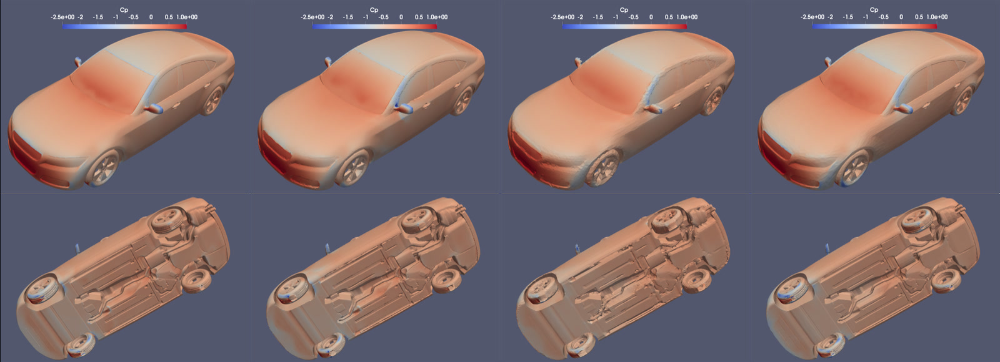
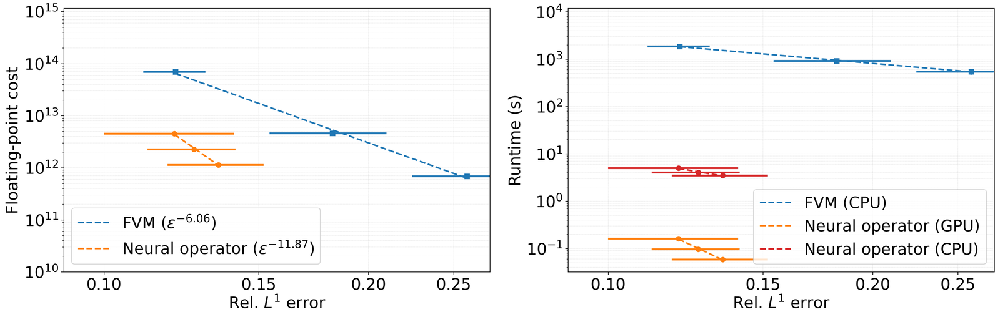

# Aerodynamics Cost–Accuracy Benchmark

This directory contains the vehicle aerodynamics benchmark used to compare a multiscale point-cloud neural operator (M-PCNO; `MPCNO` in the code) with a finite-volume OpenFOAM solver. The reported cost is the post-training, per-query inference or solve cost; training cost is not included. Accuracy is measured by an unweighted, pointwise relative $L^1$ error in the surface pressure coefficient over sampled surface points.

## Representative surface prediction

<p align="center">
  
</p>

<p align="center"><em>Surface pressure coefficient <i>C</i><sub>p</sub> for a representative vehicle. From left to right: the geometry-specific large-mesh OpenFOAM reference obtained using 7000 SIMPLE iterations; OpenFOAM predictions on the medium and small meshes; and the M-PCNO prediction on approximately 20,000 surface points. The rows show exterior and underbody views, and all panels use the same color scale.</em></p>


## Cost–accuracy trade-off

<p align="center">
  
</p>

<p align="center"><em>Vehicle-aerodynamics cost–accuracy comparison. Left: estimated floating-point work versus discrete pointwise relative <i>L</i><sup>1</sup> error in <i>C</i><sub>p</sub>. Right: wall-clock runtime for OpenFOAM on CPUs and M-PCNO inference on CPUs and GPUs. Markers show cohort means, and error bars denote one standard deviation. 
</em></p>

## Requirements

- Python 3 with PyTorch, NumPy, SciPy, Matplotlib, tqdm, VTK, meshio, PyVista, and PyMeshLab.
- OpenFOAM 12 and MPI for the finite-volume runs and VTK export.

The `*.sh` and `*.sbatch` files encode the authors' Slurm partitions, modules, paths, and GPU allocation. Treat them as cluster templates. The Python commands below are the portable entry points.

Unless stated otherwise, run commands from this directory:

```bash
cd scripts/aerodynamics
mkdir -p data figs logs models ../../data/aerodynamics
```

The repository does not include DrivAerNet++ data, generated NumPy archives, or trained checkpoints.

## Neural operator workflow

### 1. Prepare training data

Obtain the **DrivAerNet++** surface pressure dataset from the official [Harvard Dataverse repository](https://dataverse.harvard.edu/dataverse/DrivAerNet) and arrange the raw files according to the following directory structure:

```text
../../data/aerodynamics/PressureVTK/
├── E_S_WW_WM/*.vtk
├── E_S_WWC_WM/*.vtk
├── F_D_WM_WW_1/*.vtk
├── F_D_WM_WW_2/*.vtk
├── F_D_WM_WW_3/*.vtk
├── F_D_WM_WW_4/*.vtk
├── F_D_WM_WW_5/*.vtk
├── F_D_WM_WW_6/*.vtk
├── F_D_WM_WW_7/*.vtk
├── F_D_WM_WW_8/*.vtk
├── F_S_WWC_WM/*.vtk
├── F_S_WWS_WM/*.vtk
├── N_S_WW_WM/*.vtk
├── N_S_WWC_WM/*.vtk
└── N_S_WWS_WM/*.vtk
```


Given that each file contains approximately **400,000 surface points**, we downsample to a coarser mesh to reduce computational overhead. The downsampling is performed using the `decimate.py` script, which converts input VTK mesh to PLY format, applies quadric edge-collapse decimation via **pymeshlab**, transfers `p` from the original vertices to the retained vertices, recomputes and orients the normals, and exports the final processed mesh back to a VTK surface file in `PressureVTK_Processed_${N_POINT}` folder.


A single file can be processed with:

```bash
python decimate.py INPUT.vtk OUTPUT.vtk 10000
```

For one DrivAerNet++ category, use directory mode:

```bash
CATEGORY=E_S_WW_WM
N_POINT=10000
python decimate.py \
  "../../data/aerodynamics/PressureVTK/${CATEGORY}" \
  "../../data/aerodynamics/PressurePLY/${CATEGORY}" \
  "../../data/aerodynamics/PressurePLY_Processed_${N_POINT}/${CATEGORY}" \
  "../../data/aerodynamics/PressureVTK_Processed_${N_POINT}/${CATEGORY}" \
  "${N_POINT}"
```

Repeat this command for all 15 categories and for `N_POINT=10000`, `20000`, and `40000`. The requested point count is approximate because topology and boundary-preservation constraints can stop decimation earlier.  `decimate_drivaernet_dataset.sh` performs the same operation as a 15-task Slurm array, but its base path and `N_POINT` are hard-coded and must be edited for each system and resolution.


For each resolution, preprocess up to 400 cases from every category, then make the seeded 4000/512 split:

```bash
for N_POINT in 10000 20000 40000; do
  python mpcno_preprocess_data.py --n_each 400 --n_point "${N_POINT}"
  python mpcno_reduce_data.py --n_train 4000 --n_test 512 --n_point "${N_POINT}"
done
```

Preprocessing converts surface pressure to surface pressure coefficient, constructs vertex-centered mesh measures, edge adjacency, and gradient weights, and writes:

```text
../../data/aerodynamics/PressureVTK_Processed_<N_POINT>/mpcno_data.npz
../../data/aerodynamics/PressureVTK_Processed_<N_POINT>/mpcno_data_names_list.npy
```

The reduction step shuffles with seed 42, retains the first 4000 shuffled cases for training and the last 512 for testing, and writes:

```text
mpcno_data_n_train4000_n_test512.npz
mpcno_data_names_list_n_train4000_n_test512.npy
```

`mpcno_helper.py` provides utilities for: converting pressure to pressure coefficient $C_p = p/(0.5 U_\infty^2)$ with $U_\infty = 30$, $\rho = 1$, and $p_\infty = 0$, and loading and randomly shuffling the data.


### 2. Train MPCNO

The paper configuration fixes four layers, Fourier cutoff $k_{\max}=16$ (maximum coordinate index 16), a batch size of four per process, 200 epochs, and two GPUs. Train one model per surface resolution:

```bash
for N_POINT in 10000 20000 40000; do
  torchrun --standalone --nnodes=1 --nproc_per_node=2 \
    mpcno_parallel_train.py \
    --grad True --geo True --geointegral True \
    --n_layer 4 --k_max 16 --batch_size 4 --epochs 200 \
    --n_train 4000 --n_test 512 --dx_scale 10.0 \
    --n_point "${N_POINT}"
done
```

Rank 0 periodically overwrites the current checkpoint and output normalizer as:

```text
models/MPCNO_model_N4000_k16_nlayer4_npoint<N_POINT>.pth
models/MPCNO_model_N4000_k16_nlayer4_npoint<N_POINT>_normalization_y.pth
```

`mpcno_parallel_train.sh` contains the intended Slurm allocation.

### 3. Evaluate and plot MPCNO results

With all three datasets and checkpoints present, run:

```bash
python mpcno_solver.py
```

The script evaluates all 512 test geometries at 10k, 20k, and 40k points. It warms up each case, averages ten forward passes on CPU and GPU, estimates the floating-point cost, and records relative $L^2$ and $L^1$ errors in:

```text
data/cost_accuracy_mpcno_solver_data.npz
```

The saved `cost` array has shape `(3, 512, 3)` with columns `[FLOPs, CPU time, GPU time]`; `accuracy` has shape `(3, 512, 2)` with columns `[relative L2, relative L1]`. The current driver always evaluates both CPU and CUDA, so a CUDA device is required without a code change.

For prediction fields and error histograms, run:

```bash
python mpcno_plot_results.py
```
The script processes the **20k-point models**, specifically it computes the test error (relative L1) for each test case and saves the results to `data/test_rel_l1_npoint<N_POINT>.npy`, generates a bin-error plot saved as `figs/error_bin_npoint<N_POINT>.pdf`, and exports prediction VTK files for the test cases with the **largest** and **median** errors, stored as `figs/predict_npoint<N_POINT>_<data_name>.vtk`.


## Run OpenFOAM case

### 1. drivaerFastback benchmark

The OpenFOAM setup follows the `drivaerFastback/` benchmark. It is a similar OpenFOAM 12 case located in `OpenFOAM/OpenFOAM-12/tutorials/incompressibleFluid/drivaerFastback`. The folder contains:

- `system/`: files that control the simulation procedure (time, numerics, and parallel execution).
- `constant/`: static data such as the mesh, material properties, and turbulence model parameters. The geometry is stored under `constant/geometry/`, and the main vehicle surface patches are `body`, `frontWheels`, and `rearWheels`.
- `0/`: initial and boundary conditions for all solution variables (e.g., velocity `U` and pressure `p`).

After sourcing the OpenFOAM 12 environment, a small-mesh smoke test is:


The OpenFOAM setup follows `drivaerFastback/` benchmark, it is a similar OpenFOAM 12 case located in `OpenFoam/OpenFOAM-12/tutorials/incompressibleFluid/drivaerFastback`.  The folder contains:
`system/`: files that control the simulation procedure (time, numerics, parallel execution).
`constant/`: static data like the mesh, material properties, and turbulence model parameters. The geometry is stored under `constant/geometry/` and the main vehicle surface patches are:  `body`, `frontWheels`, `rearWheels`
`0/`: the initial conditions and boundary conditions for all solution variables (e.g., velocity U, pressure p).
After sourcing the OpenFOAM 12 environment, a small-mesh smoke test is:

```bash
cd drivaerFastback
./Allclean
./Allrun -m S -cores 8
```

`Allclean` removes generated time directories, meshes, post-processing output, VTK files, and logs. `Allrun` builds the mesh, decomposes the case, runs `snappyHexMesh` and `checkMesh`, then starts `foamRun` in parallel. Its mesh options are approximately:

| Option | Cells | Default run length |
| --- | ---: | ---: |
| `S` | 0.44 million | 1000 iterations |
| `M` | 3 million | 1000 iterations |
| `L` | 22.5 million | 2000 iterations |
| `XL` | 200 million | 2000 iterations |

The inflow boundary condition uses $U_\infty=30$ in `0/U`. On the original `wm2` cluster, `sbatch run_drivaer_S.sbatch` submits the small smoke test; adapt its module and scheduler directives elsewhere. Also note that `Allrun` resets `endTime` for `L` and `XL` but not for `S` and `M`, so verify `system/controlDict` before every run.

OpenFOAM-12 is already installed on `wm2`. Load the module with:
```bash
module load OpenFoam/12-openmpi4.1.5-gcc12.2.0
```
The installation directory is  `/lustre/hpc/soft/OpenFoam/OpenFOAM-12/`.


### 2. OpenFOAM with DrivAerNet++ geometries

The checked-in case demonstrates the workflow for one geometry. The reported finite-volume baseline was produced separately for six selected DrivAerNet++
geometries. The identifiers recorded in [`cost_accuracy_trade_off.py`](cost_accuracy_trade_off.py) are:

```text
drivaerFastback
E_S_WWC_WM_005
E_S_WW_WM_001
N_S_WWC_WM_001
F_S_WWC_WM_001.stl
N_S_WW_WM_001
```

The paper uses the following configurations for every selected geometry:

| Configuration | SIMPLE iterations | CPU cores |
| --- | ---: | ---: |
| Large reference | 7000 | 256 |
| Large | 2000 | 256 |
| Medium | 1000 | 32 |
| Small | 1000 | 4 |

#### Prepare the vehicle geometry

Download the selected STL surface from the
[DrivAerNet++ Harvard Dataverse repository](https://dataverse.harvard.edu/dataset.xhtml?persistentId=doi:10.7910/DVN/OYU2FG).
For example, use `E_S_WWC_WM/E_S_WWC_WM_005.stl`. Then split the combined
surface into the body, front-wheel, and rear-wheel components required by the
OpenFOAM case:

```bash
python split_drivaer_stl.py E_S_WWC_WM/E_S_WWC_WM_005.stl --output-dir output
```

If the active Python environment does not provide VTK, run the script with
ParaView's `pvpython` instead. The command writes the following files:

```text
output/body.obj.gz
output/frontWheels.obj.gz
output/rearWheels.obj.gz
```

It also reports the `wheelbase` and `average rolling radius`. Copy the three
surface files into the OpenFOAM case's `constant/geometry/` directory. In
`0/U`, replace the value assigned to `wheelRadius` with the reported average
rolling radius and the value assigned to `wheelBase` with the reported
wheelbase. The case computes the wheel angular velocity from `wheelRadius`.

#### Compute the geometry-specific reference solution

Generate the large volumetric mesh, containing more than 20 million cells, and
run OpenFOAM 12 for 7000 SIMPLE iterations. The final setting in
`system/controlDict` must be

```text
endTime 7000;
```

The supplied `Allrun` script resets `endTime` to 2000 when invoked with
`-m L`. For a reference run, either change the `L` branch in `Allrun` to 7000
or separate mesh generation from the solver launch and reset
`system/controlDict` before starting the solver.

#### Compute the surface-pressure errors

Compare the large-mesh, 2000-iteration (`L`) result and the 1000-iteration
medium- and small-mesh (`M` and `S`) results with the corresponding
7000-iteration large-mesh reference. After mapping the reference field to the
valid vertices of each comparison surface, compute the discrete pointwise
relative $L^1$ error in the surface pressure coefficient:

```math
\varepsilon_{L^1}
=
\frac{\sum_{i \in \mathcal{V}}
\left|C_{p,i}-C_{p,i}^{\mathrm{ref}}\right|}
{\sum_{i \in \mathcal{V}}\left|C_{p,i}^{\mathrm{ref}}\right|}.
```

where $\mathcal{V}$ is the set of valid comparison-surface vertices and
$C_{p}^{\mathrm{ref}}$ denotes the mapped reference field.

`compare_surface.py` is an exploratory single-case script that performs the
surface mapping and computes this error. Its active driver contains hard-coded
solution paths that must be updated before use.


## Generate the cost–accuracy figure

After `data/cost_accuracy_mpcno_solver_data.npz` exists, run:

```bash
python cost_accuracy_trade_off.py
```

This combines the computed MPCNO statistics with the six-geometry OpenFOAM summaries and writes:

```text
figs/aerodynamics_cost_accuracy.png
```

The published timing context was an Intel Xeon Platinum 8358 CPU and an NVIDIA A100 GPU. Runtime values will change with hardware, software builds, thread affinity, MPI layout, and filesystem load; record those details when generating new comparisons. The present timing boundary also excludes neural preprocessing and host-to-device transfer, as well as OpenFOAM meshing, decomposition, reconstruction, and postprocessing.
