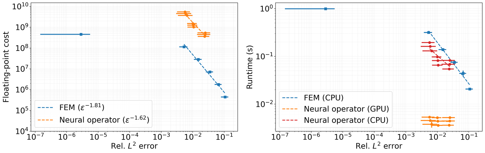

# Darcy Flow Benchmark

This directory contains the research drivers for the main-paper comparison between bilinear finite elements with geometric multigrid and the modified Fourier neural operator (MNO) for two-dimensional Darcy flow. The benchmark reports relative
$L^2$ error, estimated floating-point work, and CPU/GPU wall-clock runtime in the post-training, many-query regime.

The problem is

$$
-\nabla \cdot \left(a\nabla u\right)=1\quad\text{in }[0,1]^2,
\qquad u=0\quad\text{on the boundary},
$$

where the binary permeability field $a\in\{1,10\}$ is obtained by thresholding a Gaussian random field. The reference data use a $512\times512$ quadrilateral mesh.

## Representative solution

<p align="center">
  
</p>

<p align="center"><em>Representative test sample. From left to right: the permeability field, the reference pressure, the finite-element solution on a 64 × 64 grid, and the modified neural-operator prediction.</em></p>

## Cost–accuracy trade-off

<p align="center">
  
</p>

<p align="center"><em>Comparison between finite elements with geometric multigrid and the modified neural operator. Left: estimated floating-point work. Right: measured CPU and GPU wall-clock runtime. Markers show test-set means, and error bars denote one standard deviation.</em></p>

## Requirements

- Python with NumPy, SciPy, Matplotlib, and PyTorch.
- Firedrake and PETSc for data generation and the finite-element baseline.
- A CUDA-capable PyTorch installation for the unmodified cost–accuracy
  evaluation driver. Training falls back to the CPU, but evaluation explicitly
  runs both `torch.device("cuda")` and `torch.device("cpu")`.
- Slurm only when using the supplied `.sh` launchers.

The repository does not provide a locked environment. Run all commands below from `scripts/darcy`, because the programs use paths relative to that directory.

## Data and directory layout

Create the local output directories before running the workflow:

```bash
cd scripts/darcy
mkdir -p data figs logs models ../../data/darcy
```

The expected layout is

```text
data/darcy/
  darcy_data_00000.npy
  ...
  darcy_data_09999.npy

scripts/darcy/
  data/       Cost, error, and representative-solution archives
  figs/       Generated figures
  logs/       Slurm logs redirected by the launchers
  models/     Model and normalization checkpoints
```

Each `darcy_data_XXXXX.npy` file has shape `(513, 513, 2)`. Channel 0 is the permeability $a$, channel 1 is the reference pressure $u$, and entry `[i, j]` corresponds to $(i/512,j/512)$.

Large data files and trained checkpoints are not committed to the repository. Training with $N$ samples reads files `0,...,N-1` and uses files `9000,...,9999` as its 1,000-sample test set.

## Reproduction workflow

### 1. Generate the reference data

The generator is expensive: its current configuration creates 10,000 full-resolution Firedrake solutions. Invoke the function explicitly:

```bash
python -c "from multigrid_darcy_solver import generate_data; generate_data()"
```

The current `generate_data.sh` is a `wm2` environment template, but it does **not** call `generate_data()`: it runs the active `__main__` block described below. Adapt its final command before using it as a data-generation job.

### 2. Evaluate the finite-element baseline

Run the complete grid sweep with

```bash
python -c "from multigrid_darcy_solver import cost_accuracy_traditional_solver; cost_accuracy_traditional_solver()"
```

This evaluates $n=512,256,128,64,32,16$ on the last 10 data samples. The solver uses a multiplicative geometric-multigrid V-cycle with Richardson–Jacobi level smoothing and a direct coarse solve; the benchmark sets a relative residual tolerance of $10^{-6}$ and a maximum of 15 Richardson iterations. Results are written to `data/cost_accuracy_traditional_solver_data.npz`, with arrays for floating-point cost, CPU time, relative error, and representative solutions.

### 3. Train the modified Fourier neural operator

The main-paper sweep fixes $N=4000$, $k_{\max}=16$, and latent width $d_g=64$, then varies the layer count $L\in\{4,5,6\}$ and grid size $n\in\{128,64,32\}$. The `--downsample` argument is an exponent: values `2`, `3`, and `4` use strides $2^2$, $2^3$, and $2^4$, respectively.

On Slurm, the nine configurations are encoded by the correctly named shell launcher:

```bash
sbatch mno_train_parallel.sh
```

For a single configuration, run for example

```bash
python mno_train.py --n_train 4000 --k_max 16 --n_layer 4 --df 64 --downsample 2
```

Training uses 500 epochs, batch size 8, relative $L^2$ loss, a one-cycle learning-rate schedule, and input/output normalization. Each run creates

```text
models/MNO_model_N4000_k16_nlayer4_df64_downsample2.pth
models/MNO_model_N4000_k16_nlayer4_df64_downsample2_normalization_x.pth
models/MNO_model_N4000_k16_nlayer4_df64_downsample2_normalization_y.pth
```

with the filename parameters changed for the other configurations.

### 4. Measure MNO cost and accuracy

After all nine main-sweep checkpoints are available, run

```bash
python mno_darcy_solver.py
```

or, on the original Slurm setup,

```bash
sbatch cost_accuracy_gpu.sh
```

The active `__main__` block evaluates all nine configurations on files `09900,...,09999`, measures each inference 10 times after a warm-up, and benchmarks every downsampled grid on both the GPU and CPU. It writes `data/cost_accuracy_mno_solver_data.npz`; the cost channels are estimated flops, CPU seconds, and GPU seconds.

For the representative field shown in the paper, also run

```bash
python -c "from mno_darcy_solver import mno_solver; mno_solver(test_index=9999, downsample=2)"
python -c "from multigrid_darcy_solver import traditional_solver; traditional_solver(test_index=9999, downsample=3)"
```

This uses the $N=4000$, $k_{\max}=16$, $d_g=64$, $L=6$ checkpoint and writes `data/mno_solver_data.npz`. The second solves the same test problem using Firedrake on a \(64\times64\) mesh and saves the solution to `data/traditional_solver_data.npz`.

### 5. Create the figures

Once both complete cost–accuracy archives and the two representative-solution archives exist, run

```bash
python cost_accuracy_trade_off.py
```

The active `__main__` block creates

- `figs/darcy_flow_map.png`, the representative permeability, reference,
  finite-element, and MNO fields; and
- `figs/darcy_flow_cost_accuracy.png`, the main-paper cost–accuracy figure.


## Install Firedrake on PKU `wm2`

The commands below record the module stack used on PKU's `wm2` cluster. The module names and versions are cluster-specific; consult the [official Firedrake installation guide](https://www.firedrakeproject.org/install.html) for the current general requirements. Firedrake requires Python 3.10 or newer. For exact archival reproducibility, also record the Firedrake version installed by these commands, because the `release` configuration is updated over time.

### 1. Load the required modules

```bash
module load anaconda3/2024.10.1
module load gcc/12.2.0
module load openmpi/4.1.5-gcc_12.2.0
module load cmake/3.31.9
module load OpenBLAS/0.3.17

export OMPI_MCA_btl=self,vader,tcp
unset OMPI_MCA_pml
unset OMPI_MCA_mtl

python3 --version
mpicc --version
```

### 2. Download the configuration helper

The following commands install PETSc and Firedrake under `$HOME/src`:

```bash
mkdir -p "$HOME/src"
cd "$HOME/src"
curl -O https://raw.githubusercontent.com/firedrakeproject/firedrake/release/scripts/firedrake-configure
```

### 3. Build the Firedrake-compatible PETSc version

These instructions use `--no-package-manager`, which tells `firedrake-configure` to download and build the external PETSc packages required by its unknown-platform configuration rather than relying on distribution-specific packages.

```bash
git clone --branch $(python3 firedrake-configure --no-package-manager --show-petsc-version) https://gitlab.com/petsc/petsc.git
cd petsc/

python3 ../firedrake-configure --no-package-manager --show-petsc-configure-options | xargs -L1 ./configure
make PETSC_DIR=/lustre/home/2306192137/src/petsc PETSC_ARCH=arch-firedrake-default all
make PETSC_DIR=/lustre/home/2306192137/src/petsc PETSC_ARCH=arch-firedrake-default check
cd ..
```

### 4. Install Firedrake in a virtual environment

Run these commands from `$HOME/src`, which must contain both `petsc/` and `firedrake-configure`:

```bash
python3 -m venv venv-firedrake
. venv-firedrake/bin/activate


python -m pip cache purge

export $(python3 firedrake-configure --no-package-manager  --show-env)
python -m pip install --no-binary h5py 'firedrake[check]'
```

### 5. Verify the installation

```bash
firedrake-check
```

When any library is not supported, for example h5py
```bash
pip uninstall -y h5py
pip install --upgrade firedrake
```
### Use the existing installation on `wm2`

For each new login session, reload the same modules and reactivate the virtual environment:

```bash
module load anaconda3/2024.10.1
module load gcc/12.2.0
module load openmpi/4.1.5-gcc_12.2.0
module load cmake/3.31.9
module load OpenBLAS/0.3.17

export OMPI_MCA_btl=self,vader,tcp
unset OMPI_MCA_pml
unset OMPI_MCA_mtl


. $HOME/src/venv-firedrake/bin/activate
```
