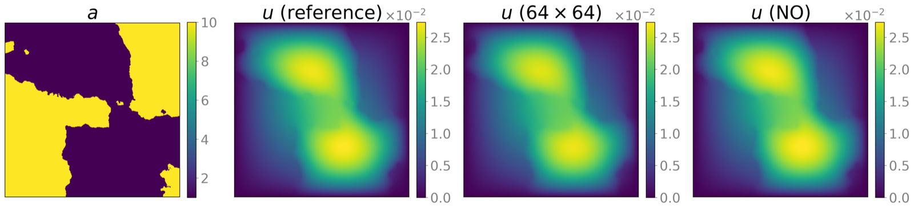
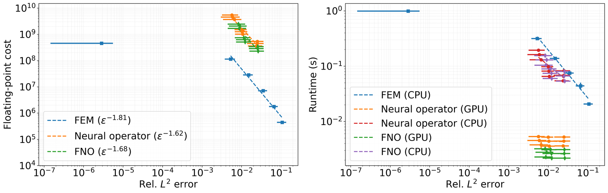

# Standard-FNO Sensitivity Study for Darcy Flow

This directory contains the research drivers for the supplementary architecture-sensitivity study for
the Darcy benchmark. It replaces the modified neural operator used in the main
experiment with a standard Fourier neural operator (FNO), while retaining the
same data, training protocol, evaluation samples, and cost–accuracy metrics.
In the implementation, this distinction is selected by `grad_layer=False`.

The experiment is intentionally downstream of [`../darcy`](../darcy): it
reuses the 10,000 Darcy reference files and the finite-element and modified
neural-operator result archives generated there.

## Shared Darcy benchmark

<p align="center">
  
</p>

<p align="center"><em>The Darcy benchmark figure from the main paper. From left to right: the permeability field, the reference pressure, the finite-element solution on a 64 × 64 grid, and the MNO prediction. The standard FNO uses the same physical problem and data; the final panel is the main-study MNO result, not an FNO prediction.</em></p>

## Cost–accuracy curve

<p align="center">
  
</p>

<p align="center"><em>Cost–accuracy comparison among finite elements with geometric multigrid, the modified neural operator, and the standard FNO. Left: estimated floating-point work. Right: measured CPU and GPU wall-clock runtime. Markers show test-set means, and error bars denote one standard deviation.</em></p>

## Requirements

- Python with NumPy, Matplotlib, and PyTorch.
- A CUDA-capable PyTorch installation for the unmodified evaluation driver,
  which explicitly benchmarks both CUDA and CPU execution.
- Slurm only when using the supplied `.sh` launchers.
- The completed main Darcy workflow in `../darcy`. Firedrake is not needed for
  FNO training or inference once the data and baseline archives exist.

Run every command below from `scripts/darcy_fno`, because the scripts use
paths relative to that directory.

## Data and directory layout

Create the local output directories first:

```bash
cd scripts/darcy_fno
mkdir -p data figs logs models
```

The workflow expects

```text
../../data/darcy/
  darcy_data_00000.npy
  ...
  darcy_data_09999.npy

../darcy/data/
  cost_accuracy_traditional_solver_data.npz
  cost_accuracy_mno_solver_data.npz

data/       FNO cost, error, and optional prediction archives
figs/       Supplementary figure
logs/       Slurm logs redirected by the launchers
models/     FNO model and normalization checkpoints
```

Each Darcy file has shape `(513, 513, 2)`, with permeability in channel 0 and
the reference pressure in channel 1. As in the main Darcy workflow, training
with $N$ samples reads files `0,...,N-1` and uses files
`9000,...,9999` as the 1,000-sample test set.

## Reproduction workflow

### 1. Train the FNO configurations

The supplementary comparison uses $N=4000$, $k_{\max}=16$, latent width
$d_g=64$, layer counts $L\in\{4,5,6\}$, and grid sizes
$n\in\{128,64,32\}$. The `--downsample` values `2`, `3`, and `4` denote
strides $2^2$, $2^3$, and $2^4$, respectively.

The nine configurations are encoded by the correctly named shell launcher:

```bash
sbatch fno_train_parallel.sh
```

For a single configuration, run for example

```bash
python fno_train.py --n_train 4000 --k_max 16 --n_layer 4 --df 64 --downsample 2
```

Training uses 500 epochs, batch size 8, relative $L^2$ loss, a one-cycle
learning-rate schedule, and input/output normalization. Each configuration
produces a model checkpoint and two normalization checkpoints, for example

```text
models/FNO_model_N4000_k16_nlayer4_df64_downsample2.pth
models/FNO_model_N4000_k16_nlayer4_df64_downsample2_normalization_x.pth
models/FNO_model_N4000_k16_nlayer4_df64_downsample2_normalization_y.pth
```

### 2. Measure FNO cost and accuracy

After all nine checkpoints are available, run

```bash
python fno_darcy_solver.py
```

or submit the supplied GPU job:

```bash
sbatch cost_accuracy_gpu.sh
```

This is the active `__main__` behavior of `fno_darcy_solver.py`. It evaluates
all nine configurations on files `09900,...,09999`, performs a warm-up, times
each prediction over 10 repetitions, and benchmarks every downsampled grid on
both the GPU and CPU. Results are saved to
`data/cost_accuracy_fno_solver_data.npz`; its cost channels are estimated
flops, CPU seconds, and GPU seconds.

An optional representative prediction can be generated with

```bash
python -c "from fno_darcy_solver import fno_solver; fno_solver(test_index=9999, downsample=2)"
```

This uses the $N=4000$, $k_{\max}=16$, $d_g=64$, $L=6$ checkpoint and
writes `data/fno_solver_data.npz`. The current supplementary plotting entry
point does not consume this optional archive.

### 3. Create the supplementary figure

After the FNO archive and both sibling Darcy archives exist, run

```bash
python cost_accuracy_trade_off.py
```

The active `__main__` block reads

- `../darcy/data/cost_accuracy_traditional_solver_data.npz`,
- `../darcy/data/cost_accuracy_mno_solver_data.npz`, and
- `data/cost_accuracy_fno_solver_data.npz`,

then writes `figs/supp_darcy_flow_cost_accuracy.png`. The figure compares
finite elements with geometric multigrid, the modified neural operator, and
the standard FNO in floating-point work and CPU/GPU runtime at matched error.
