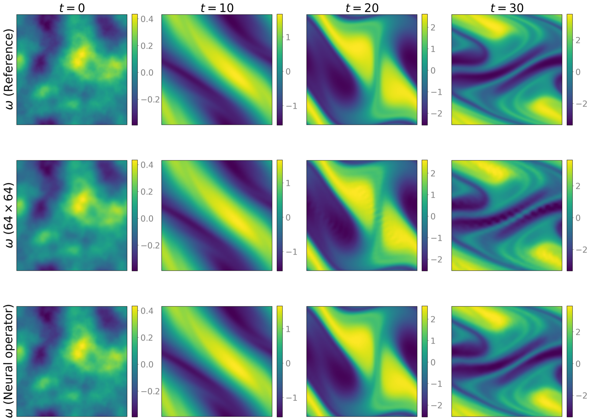
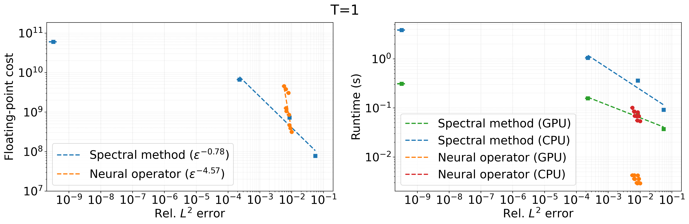
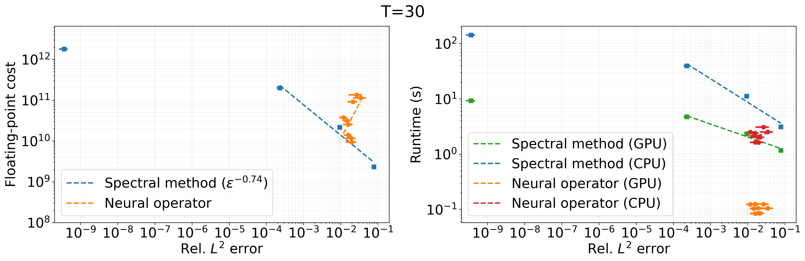

# 2D Incompressible Navier–Stokes Benchmark

This directory contains the research drivers for the time-dependent benchmark in the paper. It compares a Fourier pseudospectral solver with fourth-order Runge–Kutta (RK4) time integration against a recurrent neural operator, with exponential time-differencing methods included in a sensitivity study. The comparison reports relative $L^2$ error, estimated floating-point work, and CPU/GPU wall-clock runtime in the post-training, many-query regime.

The neural operator learns the unit-time map

$$
(\omega(t),f_{\rm bench},[0,1]^2) \longmapsto \omega(t+1),
$$

and applies it recurrently at longer prediction horizons. Its principal advantage in this example is reduced sequential depth: one learned update replaces many CFL-limited RK4 steps.

## Representative rollout

<p align="center">
  
</p>

<p align="center"><em>Representative vorticity trajectory. Columns show <i>t</i> = 0, 10, 20, and 30; rows show the 256 × 256 reference, the Fourier pseudospectral solution on a 64 × 64 grid, and the recurrent neural-operator prediction.</em></p>

## Cost–accuracy trade-off

<p align="center">
  
</p>

<p align="center">
  
</p>

<p align="center"><em>Cost–accuracy trade-offs for teacher-forced one-step prediction (top) and recurrent rollout through <i>T</i> = 30 (bottom). In the one-step evaluation, each reference state at <i>t</i> = 0,…,29 is used to predict the state at <i>t</i> + 1, and the results are averaged over the 30 transitions. Left panels show estimated floating-point work; right panels show CPU and GPU wall-clock runtime. Markers show test-set means, and error bars denote one standard deviation.</em></p>

## Paper configuration

The experiment solves the vorticity equation on the periodic domain $D=[0,1]^2$,

$$
\partial_t\omega+v\cdot\nabla\omega=\nu\Delta\omega+f,
\qquad
f_{\rm bench}(x)=0.1\!\left[\cos(2\pi(x_1+x_2))+\sin(2\pi(x_1+x_2))\right],
$$

with viscosity $\nu=10^{-4}$. Initial vorticity fields are centered Gaussian random fields generated with $\alpha=2.5$, $\tau=7$, and random seed 42.

| Component | Configuration |
|---|---|
| Reference trajectories | $256\times256$ periodic grid; RK4; $\Delta t=10^{-3}$; snapshots at integer times from 0 through 50 |
| Classical comparison | Grids $256^2,128^2,64^2,32^2$; $\Delta t=1/(2n)$ for RK4 and ETDRK4 and $\Delta t=1/(8n)$ for ETD1; CPU and GPU execution |
| Neural-operator input | Current vorticity, fixed forcing, and the two coordinate fields (four channels) |
| Neural-operator sweep | Resolutions $128^2,64^2,32^2$; $k_{\max}=16$; width 64; 4, 5, or 6 layers |
| Training | Approximately 10,000 two-step training windows drawn from 200 trajectories; two-step recurrent loss; 500 epochs; batch size 8 |
| Evaluation | Teacher-forced one-step error averaged over 30 transitions and recurrent-rollout error averaged over $t=1,\ldots,30$ |

## Requirements

Run all commands from this directory because the scripts use relative paths:

```bash
cd scripts/navier_stokes
mkdir -p ../../data/navier_stokes data figs logs models
```

The repository does not provide a locked environment. The Python workflow requires Python 3, NumPy, SciPy, Matplotlib, and PyTorch. Install a PyTorch build appropriate for the local CPU or CUDA runtime. The classical solver requires Julia with the following packages:

```julia
using Pkg
Pkg.add(["GeophysicalFlows", "FourierFlows", "NPZ", "CUDA"])
```

An NVIDIA GPU is required to reproduce the GPU timings. Reported runtimes are hardware- and implementation-dependent.

## Data layout

The workflow expects the following layout:

```text
data/navier_stokes/                         # repository-level trajectory data
  navier_stokes_zeta0.npy                   # all sampled initial conditions
  navier_stokes_00000.npy
  ...
  navier_stokes_01999.npy

scripts/navier_stokes/
  data/                                     # evaluation archives
  figs/                                     # generated figures
  logs/                                     # Slurm and training logs
  models/                                   # neural-operator checkpoints
```

Each trajectory file is a NumPy array of shape `(52, 256, 256)`. Channel 0 stores the fixed forcing field, and channels 1–51 store $\omega(t)$ at integer times $t=0,\ldots,50$. The periodic grid point at array index `(i, j)` is $(i/256,j/256)$; the endpoint is excluded. The complete 2,000-trajectory data set occupies roughly 55 GB in double precision and is not included in the repository.

## Reproduction workflow

### 1. Generate reference trajectories

Generate 2,000 initial conditions:

```bash
python -c 'from navier_stokes import generate_initial_condition; generate_initial_condition(nx=256, ny=256, ndata=2000)'
```

At the bottom of [`spectral_navier_stokes_solver.jl`](spectral_navier_stokes_solver.jl), select

```julia
generate_data(nx = 256, ny = 256, ndata = 2000)
```

and disable the other driver calls before running

```bash
julia --threads=16 spectral_navier_stokes_solver.jl
```

This stage uses CPU threads and writes the trajectory files described above. The site-specific Slurm launcher `bash_cpu.sh` runs the currently selected Python and Julia drivers; inspect their active bottom-of-file calls before submitting it.
### 2. Evaluate the classical solver

For the recurrent-rollout data, select the following driver call at the bottom of [`spectral_navier_stokes_solver.jl`](spectral_navier_stokes_solver.jl):

```julia
cost_accuracy_traditional_solver(n_downsample = 4, n_trial = 10, stepper = "RK4")
```

For the teacher-forced one-step data, use

```julia
cost_accuracy_traditional_solver_onestep(n_downsample = 4, n_trial = 10, stepper = "RK4")
```

Run the Julia script once for each selected driver. The two calls evaluate the four grid resolutions on both CPU and GPU and write

```text
data/cost_accuracy_traditional_solver_data.npz
data/cost_accuracy_traditional_solver_onestep_data.npz
```

The one-step evaluator starts separately from each reference state $\omega(t)$, $t=0,\ldots,29$, predicts $\omega(t+1)$, and records the error and runtime for each of the 30 transitions. 

To reproduce the time-integrator sensitivity study, repeat the corresponding call with `stepper="ETD1"` and `stepper="ETDRK4"`. These runs append `_ETD1` or `_ETDRK4` to the archive name. ETD1 uses $\Delta t=1/(8n)$, whereas RK4 and ETDRK4 use $\Delta t=1/(2n)$. 

For the RK4 call above, when called with `n_downsample=4` and `n_trial=10`,
`cost_accuracy_traditional_solver()` uses the final ten trajectory files,
`navier_stokes_01990.npy` through `navier_stokes_01999.npy`. For each
trajectory, it solves the equation on grids with $n\in\{256,128,64,32\}$ points in each spatial direction, using the time step $\Delta t=1/(2n)$. The solver records the solution at unit time intervals $t=0,1,\ldots,50$ and compares each snapshot with the corresponding restriction of the stored $256^2$ reference trajectory generated in step 1. The resulting archive contains the estimated floating-point operation counts, measured CPU and GPU runtimes, and time-resolved relative $L^2$ errors.

The time-resolved errors in this archive also provide the spectral-method curves in the rollout-horizon figure. Specifically, `nrollouts_plot()` reads the CPU error histories for the $128^2$, $64^2$, and $32^2$ spectral grids; the $256^2$ curve is not displayed in the current figure.

For the representative flow map used for visualization, instead select

```julia
traditional_solver(test_index = 1999, downsample = 2)
```

which writes `data/traditional_solver_data.npz` for the $64\times64$ spectral prediction. This single-trajectory archive is used only for the representative flow map; it is not the source of the classical curves in the rollout-horizon figure.

### 3. Train the neural operators

The paper sweep contains nine models: three resolutions (`downsample=1,2,3`) and three depths (`n_layer=4,5,6`), with 10,000 two-step training windows, $k_{\max}=16$, width 64, and a two-step rollout loss. On a suitably configured Slurm cluster, submit

```bash
sbatch mno_train_parallel.sh
```

For a single configuration, run, for example,

```bash
python mno_train.py \
  --n_train 10000 \
  --k_max 16 \
  --n_layer 4 \
  --df 64 \
  --downsample 1 \
  --n_roll_out 2
```

Checkpoints are written under `models/` using names such as

```text
MNO_model_N10000_k16_nlayer4_df64_downsample1_nrollout2.pth
```

Normalizers are not used in this benchmark.

#### Rollout-loss sensitivity

To assess the effect of the rollout loss, train otherwise identical models with `n_roll_out=1,2,3` while holding the architecture, spatial resolution, data, and optimization settings fixed. Here, `n_roll_out` is the number of consecutive autoregressive prediction steps included in each training target; it is distinct from the 30-step horizon used for long-rollout evaluation. The sensitivity study uses the $128\times128$ resolution (`downsample=1`), six layers, $k_{\max}=16$, and width 64:

```bash
for N_ROLL_OUT in 1 2 3; do
  python mno_train.py \
    --n_train 10000 \
    --k_max 16 \
    --n_layer 6 \
    --df 64 \
    --downsample 1 \
    --n_roll_out "${N_ROLL_OUT}"
done
```

Evaluating these models with the same 50-step autoregressive procedure assesses the effect of the training rollout horizon on error accumulation.

### 4. Evaluate neural-operator cost and accuracy

The active driver in [`mno_navier_stokes_solver.py`](mno_navier_stokes_solver.py) evaluates all nine paper configurations in the teacher-forced one-step setting on the final 100 trajectories. Each transition is timed ten times on both GPU and CPU:

```bash
python mno_navier_stokes_solver.py
```

It writes `data/cost_accuracy_mno_solver_onestep_data.npz`. Each reference
state at $t=0,\ldots,29$ is supplied independently to predict the state at
$t+1$; the archive stores the 30 errors and the directly measured mean
one-step runtime.

To generate the 50-step recurrent-rollout archive used for the $T=30$
comparison, select the commented `cost_accuracy_mno_solver(...)` call with
the same nine configurations and `n_trial=100`. Run it separately to write
`data/cost_accuracy_mno_solver_data.npz`.

To generate the representative prediction used in the flow map, select

```python
mno_solver(test_index=1999, downsample=1, n_roll_out=2)
```

in the same file and run it separately; this writes `data/mno_solver_data.npz`.

For the rollout-loss sensitivity study, after the three checkpoints described above are available and their names are consistent with the evaluator, select

```python
accuracy_mno_solver(nrollouts=[1, 2, 3], n_trial=10)
```

to create `data/accuracy_mno_solver_nrollout_data.npz`.

This archive provides the three neural-operator curves in the supplementary rollout-horizon figure. With `n_trial=10`, the current Python evaluator uses the same final ten trajectories, `navier_stokes_01990.npy` through `navier_stokes_01999.npy`. The classical and neural curves are therefore averaged over the same evaluation set; the reversed loading order in the Julia driver does not affect the reported means or standard deviations.

### 5. Plot the results

[`cost_accuracy_trade_off.py`](cost_accuracy_trade_off.py) contains the plotting functions used for the main and supplementary figures. Run all commands in this section from `scripts/navier_stokes`, and create the output directory first:

```bash
mkdir -p figs
```

#### `visualize_data(visualize_prediction=True)`

This function creates the representative vorticity-field figure at $t=0,10,20,30$. It reads the $256^2$ reference trajectory `../../data/navier_stokes/navier_stokes_01999.npy`, the $64^2$ spectral rollout
`data/traditional_solver_data.npz`, and the $128^2$ neural-operator rollout `data/mno_solver_data.npz`. All three rows use the reference color range at each time so that their fields can be compared directly. The output is

```text
figs/navier_stokes_flow_map.png
```

The active main block calls this function with `visualize_prediction=True`. Calling it with `False` plots only the reference row and overwrites the same output file. To generate only the complete flow map, run

```bash
python -c "from cost_accuracy_trade_off import visualize_data; visualize_data(True)"
```

#### Main cost-accuracy figures

`cost_accuracy_onestep_plot()` reads the two `*_onestep_data.npz` archives,
averages each test trajectory over the 30 teacher-forced transitions, and
writes

```text
figs/navier_stokes_cost_accuracy_1.png
```

`cost_accuracy_plot(nt_error=30)` reads the two recurrent-rollout archives, averages the errors over predicted states at $t=1,\ldots,30$, and writes

```text
figs/navier_stokes_cost_accuracy_30.png
```

Both functions plot

- estimated floating-point work versus relative $L^2$ error; and
- CPU and GPU wall-clock runtime versus relative $L^2$ error.

```bash
python -c "from cost_accuracy_trade_off import cost_accuracy_onestep_plot, cost_accuracy_plot; cost_accuracy_onestep_plot(); cost_accuracy_plot(nt_error=30)"
```

#### Time-integrator sensitivity figures

`cost_accuracy_onestep_plot_etd()` and `cost_accuracy_plot_etd(nt_error=30)`
add the ETD1 and ETDRK4 results to the corresponding comparisons and write

```text
figs/supp-navier_stokes_cost_accuracy_1.png
figs/supp-navier_stokes_cost_accuracy_30.png
```

They require the RK4, ETD1, and ETDRK4 classical archives described above,
together with the corresponding one-step or recurrent neural-operator archive.

#### `nrollouts_plot()`

This function creates the supplementary rollout-horizon comparison. It combines

- the CPU error histories for the $128^2$, $64^2$, and $32^2$ spectral methods
  from `data/cost_accuracy_traditional_solver_data.npz`; and
- the neural-operator error histories for training rollout horizons
  `n_roll_out=1,2,3` from `data/accuracy_mno_solver_nrollout_data.npz`.

The curves report mean relative $L^2$ error over the same final ten reference
trajectories at times $t=0,\ldots,50$. Here, the labels $s=1,2,3$ identify the
number of recurrent steps included during training, not the evaluation
horizon. The current error bars equal one standard deviation. The function writes

```text
figs/navier_stokes_nrollout_accuracy.png
```

To generate only this figure, run

```bash
python -c "from cost_accuracy_trade_off import nrollouts_plot; nrollouts_plot()"
```


#### Run all active plotting functions

The current `__main__` block calls `visualize_data(True)`, the one-step and
recurrent cost-accuracy functions, their ETD variants, and `nrollouts_plot()`.
It therefore requires the raw reference trajectory

```text
../../data/navier_stokes/navier_stokes_01999.npy
```

and the following evaluation archives:

```text
data/traditional_solver_data.npz
data/mno_solver_data.npz
data/cost_accuracy_traditional_solver_data.npz
data/cost_accuracy_traditional_solver_data_ETD1.npz
data/cost_accuracy_traditional_solver_data_ETDRK4.npz
data/cost_accuracy_traditional_solver_onestep_data.npz
data/cost_accuracy_traditional_solver_onestep_data_ETD1.npz
data/cost_accuracy_traditional_solver_onestep_data_ETDRK4.npz
data/cost_accuracy_mno_solver_data.npz
data/cost_accuracy_mno_solver_onestep_data.npz
data/accuracy_mno_solver_nrollout_data.npz
```


```bash
python cost_accuracy_trade_off.py
```
